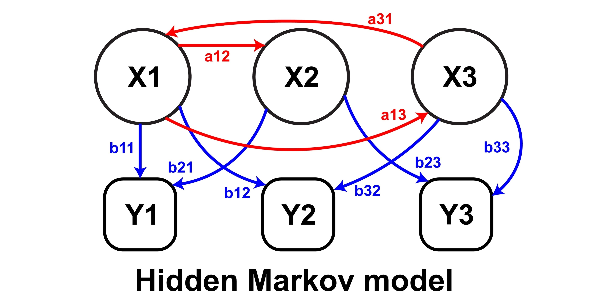

# Markov Chains in Financial Markets
-- Part 1 --

Markov chains are a class of stochastic models used to describe a sequence of possible events where the probability of each event depends only on the state attained in the previous event. This **"memoryless"** property is what makes them both simple and powerful. In financial markets, this translates to the assumption that the future behavior of an asset or market regime is solely dependent on its current state, not on how it arrived there. While this is a simplification, it forms the basis for a surprisingly effective analytical framework.

## The Mathematical Foundation: States and Transition Probabilities

A Markov chain is formally defined by a set of **states** and a **transition matrix**. Let $S = \{s_1, s_2, ..., s_N\}$ be the finite set of possible states. The system's state at time $t$ is denoted by $X_t$. The core of the model is the **transition probability matrix**, $P$. Each element $P_{ij}$ represents the probability of transitioning from state $s_i$ to state $s_j$ in a single time step.

$P_{ij} = P(X_{t+1} = s_j | X_t = s_i)$

This matrix must satisfy two key properties:
1. $0 \le P_{ij} \le 1$ for all $i,j$.
2. $\sum_{j=1}^{N} P_{ij} = 1$ for all $i$. (The sum of probabilities from any state must equal 1).

Consider a three-state model for a market's daily movement: $S = \{\text{Up}, \text{Down}, \text{Flat}\}$. The transition matrix $P$ would be a $3 \times 3$ matrix:

$$
P = 
\begin{pmatrix}
p_{\text{UU}} & p_{\text{UD}} & p_{\text{UF}} \\
p_{\text{DU}} & p_{\text{DD}} & p_{\text{DF}} \\
p_{\text{FU}} & p_{\text{FD}} & p_{\text{FF}}
\end{pmatrix}
$$

For instance, $p_{\text{UD}}$ is the probability that the market transitions from an "Up" state to a "Down" state the next day.

---

## Extending the Model: Multi-Step Transitions and Stationarity

The real power of Markov chains emerges when we consider transitions over multiple time steps. The probability of moving from state $i$ to state $j$ in $k$ steps is given by the $ij$-th element of the matrix $P^k$.

$P(X_{t+k} = s_j | X_t = s_i) = (P^k)_{ij}$

This allows us to answer questions like: "What is the probability of the market being in a 'Bull' state in three months, given it is a 'Bear' market today?" 

An important concept for long-term analysis is the **stationary distribution** (also known as the limiting distribution or equilibrium distribution). If a Markov chain is **ergodic** (i.e., it's possible to get from any state to any other state and it's not periodic), the system will eventually converge to a stable distribution of states, regardless of the initial state. The stationary distribution vector $\pi = (\pi_1, \pi_2, ..., \pi_N)$ satisfies the equation $\pi P = \pi$, where $\sum_{i=1}^{N} \pi_i = 1$. The component $\pi_i$ represents the long-run proportion of time the system spends in state $s_i$.

In a financial context, the stationary distribution can reveal the long-term probabilities of the market being in a bull, bear, or flat state, which is crucial for strategic, long-horizon portfolio planning.

---

## Advanced Applications in Quantitative Finance

#### 1. Regime-Switching Models
One of the most powerful applications is the **Hidden Markov Model (HMM)**. In this model, the market's underlying state (e.g., high volatility vs. low volatility) is not directly observable—it's "hidden." What we do observe is the **output** from that state, such as asset returns. For example, a high-volatility regime might produce large price swings, while a low-volatility regime produces small, steady movements. An HMM uses Markov chains to model the transitions between these hidden regimes and uses the observed returns to infer the probability of being in each regime at any given time. This is a far more realistic approach to modeling market behavior than assuming a single, constant volatility. 

#### 2. Credit Risk and Transition Matrices
As mentioned earlier, credit ratings (e.g., from Standard & Poor's or Moody's) can be viewed as states in a Markov chain. Rating agencies publish historical transition matrices, which show the probability of a company's rating changing over a one-year period. For example, the probability of a company rated 'A' being downgraded to 'BBB' is given by a specific entry in the matrix.

$$
P = 
\begin{pmatrix}
... & ... & ... & ... & ... \\
... & p_{\text{A} \to \text{A}} & p_{\text{A} \to \text{BBB}} & ... & ... \\
... & ... & ... & ... & ...
\end{pmatrix}
$$

Financial institutions use these matrices to calculate **expected credit losses** on their loan portfolios. By multiplying the initial rating distribution of their loans by the transition matrix, they can project the distribution of ratings and, therefore, the probability of default over time.

#### 3. Asset Pricing and Portfolio Management
Markov models can be integrated into asset pricing models. For instance, a **Markov-switching GARCH model** (Generalized Autoregressive Conditional Heteroskedasticity) allows the volatility of an asset to switch between different regimes (e.g., low, medium, and high volatility) according to a Markov chain. This captures the "volatility clustering" seen in financial markets—periods of high volatility tend to be followed by more high volatility. By incorporating this dynamic, practitioners can create more accurate risk forecasts and design more robust portfolio allocation strategies.

---

### An Example: Estimating the Transition Matrix

The key challenge for practitioners is estimating the transition matrix $P$ from historical data. This is typically done using the **Maximum Likelihood Estimation** method. For each state transition, we simply count the number of times it occurred and divide by the total number of times the system was started.

Let $n_{ij}$ be the number of observed transitions from state $s_i$ to $s_j$.
Let $n_i$ be the total number of times the system was in state $s_i$.
The estimated transition probability $\hat{P}_{ij}$ is:

$$\hat{P}_{ij} = \frac{n_{ij}}{n_i}$$

For example, if the market was in an "Up" state 500 times, and 300 of those times it stayed "Up" the next day, while 150 times it went "Down" and 50 times it went "Flat," the estimated probabilities would be:

$p_{\text{UU}} = 300/500 = 0.6$

$p_{\text{UD}} = 150/500 = 0.3$

$p_{\text{UF}} = 50/500 = 0.1$

While the memoryless property is a strong assumption, Markov chains provide a powerful and flexible framework for modeling dynamic systems in finance. By embracing this probabilistic approach, practitioners can gain valuable insights into market behavior, manage risk, and optimize investment decisions in a world of constant change.

---

Next Section (part 2): [Using Markov chain to analyze first insight of a forex pair, index, or any market](https://github.com/handiko/Markov-Chain-UpDown-Day/blob/main/README.md)

Next section (part 3): [Using a Markov chain to determine market risk](https://github.com/handiko/Markov-Chain-In-Financial-Market-Risk/blob/main/README.md)
